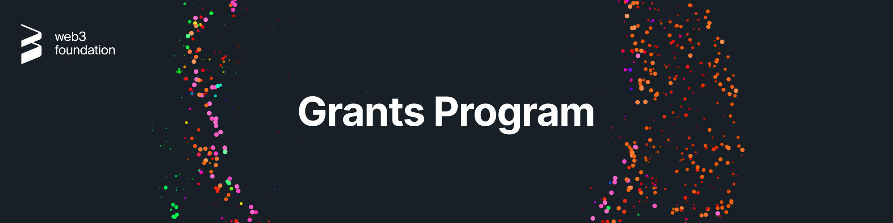

# Pangolin Grants Program<!-- omit in toc -->

  

- [:wave: Introduction](#wave-introduction)
  - [Guidelines](#guidelines)
  - [Project ideas](#project-ideas)
  - [Support](#support)
  - [Team](#team)
- [:level_slider: Levels](#level_slider-levels)
- [:pencil: Process](#pencil-process)
  - [1. Application](#1-application)
  - [2. Application Review](#2-application-review)
  - [3. Milestone Delivery and Payment](#3-milestone-delivery-and-payment)
  - [Changes to a Grant after Approval](#changes-to-a-grant-after-approval)
- [:mailbox_with_mail: Suggest a Project](#mailbox_with_mail-suggest-a-project)
- [:hammer_and_wrench: Maintenance Grants](#hammer_and_wrench-maintenance-grants)
- [:bulb: Help](#bulb-help)
  - [Additional information](#additional-information)
  - [Real-time conversation](#real-time-conversation)

## :wave: Introduction

As part of our commitment to promoting the Web3 ecosystem, we offer a comprehensive grants program focused on funding software development and research efforts related to **Pangolin and DaaS**. For more information about Pangolin, please visit the [Website](https://pangolin.exchange/).

### Guidelines

Anyone is welcome to apply for a grant. Projects funded through our programs are broad in scope, but our focus lies on strong **technical** projects that add value to the ecosystem.

Generally, your project will have better chances to be accepted if:

- It presents a **well-researched** or tested concept, for which ideally you are able to show some prior work.
- You can demonstrate that the project will be **maintained** after completion of the grant, be it through an obvious commitment to the technology from your side, additional funding sources or an existing business model.
- Your team has **proven experience** with the relevant languages and technologies and/or a strong technical background. You will be asked to provide the GitHub profiles of your team members as part of your application, which we will examine these for past activity and code quality. Naturally, you can also link to projects on other platforms.
- Your application is **rich in technical details** and well-defined.
- You can clearly present how your project stands out among competitors or implements technology that doesn't exist in the ecosystem yet.

Additionally, it must fulfill the following requirements:

- All code produced as part of a grant must be **open-sourced**, and it must also not rely on closed-source software for full functionality. We prefer Apache 2.0, but GPLv3, MIT or Unlicense are also acceptable.
- We do not award grants for projects that have been the object of a successful token sale.
- As a general rule, teams are asked to finish a grant before applying for another one.
- Lastly, we do not fund projects that actively encourage gambling, illicit trade, money laundering or criminal activities in general.

In addition to the information provided on your application, note that your project will need to comply with our [Guidelines for Milestone Deliverables](docs/milestone-deliverables-guidelines.md). In particular, we require all projects to create documentation that explains how their project works. At a minimum, _written_ documentation is required for funding. Tutorials or videos are also helpful for new users to understand how to use your product.

Please also heed our [Announcement Guidelines](docs/announcement-guidelines.md) for grant-related communications.

Finally, we take licensing and the right of all teams in and outside the ecosystem to be recognised for their work very seriously. Using others' work with no attribution or indication that this was not your own work as part of a milestone delivery **will lead to immediate termination**. Please reach out to us before submitting if you have any doubts on how to comply with a specific license and we'll be happy to help.

We also try to enforce our [code of conduct](CODE_OF_CONDUCT.md) and based on this may [block users](https://github.blog/2016-04-04-organizations-can-now-block-abusive-users/).

### Project ideas

An overview of existing projects in the Pangolin Technology Stack along with broad project ideas we would potentially be interested in funding can be found [here](docs/pangolin_stack.md), as well as a list of previously accepted applications [here](docs/accepted_grant_applications.md).

[Requests For Proposals](rfps) (RFPs) represent concrete ideas for projects that we would like to see implemented. Several teams may apply for the same RFP, so even if another team has already applied to implement a certain RFP, we invite you to do the same if you're interested.

Finally, you don't need to start your own project in order to be eligible for a grant. Instead, some teams choose to port existing work to Pangolin, where the pertinent licenses allow, or even to contribute to an existing open-source project. In the latter case, you should check in advance that the maintainers of the project are interested in your contribution, and the acceptance of the milestones will generally be tied to the inclusion of your work in said project. See the [Maintenance Grants section](#hammer_and_wrench-maintenance-grants) for more info.

If you have a **good concept of the technical challenges** that your idea entails and would like feedback before applying, you can send us an [email](mailto:justin@pangolin.exchange) and tell us about it.

### Support

The scope of our Grants Programs consists of funding and feedback on delivered milestones. This means that we do not provide hands-on support as part of a grant, but if you face specific issues during development, we will do our best and try to direct you to the correct resources. 

For questions about the grants program itself, see our [FAQ](docs/faq.md#frequently-asked-questions).

### Team

#### Pangolin Grants Committee<!-- omit in toc -->

The committee consists of individuals who know the funding priorities of the Pangolin ecosystem, and is responsible for evaluating grant applications and providing feedback on these.

In cases where a niche expert opinion is desirable, one of the committee members may request such a review.

- [Justin Trollip](https://github.com/HariSeldon23)

#### Pangolin Grants Evaluators<!-- omit in toc -->

Evaluators are individuals able to evaluate the technology delivered as a result of the Grants Program. The committee has the right to add or remove evaluators on the basis of supermajority.

- [Justin Trollip](https://github.com/HariSeldon23)
- [Sarju Hansaliya](https://github.com/SarjuHansaliya)
- [Brandon](https://github.com/bmino)
- [Shungy](https://github.com/Shungy)

#### Pangolin Operations Team<!-- omit in toc -->

The Operations Team takes care of legal documents, invoicing and remittances.

- [Justin Trollip](https://github.com/HariSeldon23)
- [Shane McCann](mailto:shane@pangolin.exchange)
- [Firat Akkan](mailto:firat@pangolin.exchange)

## :level_slider: Levels

The Pangolin Grants Program offers different grant levels to help you best depending on your current stage.

### :hatching_chick: Level 1 (= InstaGrants)<!-- omit in toc -->

- **Target:** Individuals & small teams
- **Amount:** Up to $5,000
- **Requirements:** 2 approvals
- **Benefits:** Feedback during application process and evaluation, introduction to related teams/projects

### :baby_chick: Level 2<!-- omit in toc -->

- **Target:** Small teams/start-ups
- **Amount:** Up to $15,000
- **Requirements:** 3 approvals
- **Benefits:** All of the above + [co-promotion](./docs/announcement-guidelines.md#announcement-guidelines), [Grants Program badge](./docs/grant-badge-guidelines.md)

### :rooster: Level 3<!-- omit in toc -->

- **Target:** Companies/foundations with a proven track record
- **Amount:** Unlimited
- **Requirements:** 5 approvals (for >$100k: Pangolin Council approval + Pitch call)
- **Benefits:** All of the above + VC introductions

## :pencil: Process

> **:loudspeaker:** The process below is independent of the [level](#level_slider-levels). Payment is made in Bitcoin, USDT, USDC, DAI or aUSD. If you want to apply in **private**  and/or you need to be paid out in **fiat**, you can apply [:arrow_right: here](https://docs.google.com/forms/d/e/1FAIpQLSfMfjiRmDQDRk-4OhNASM6BAKii7rz_B1jWtbCPkUh6N7M2ww/viewform). Note that this is generally a slower process and imposes stricter requirements on applicants.

### 1. Application

   0. Please read our [FAQs](https://github.com/w3f/Grants-Program/blob/master/docs/faq.md), [category guidelines](https://github.com/w3f/Grants-Program/blob/master/docs/grant_guidelines_per_category.md), [announcement guidelines](https://github.com/w3f/Grants-Program/blob/master/docs/announcement-guidelines.md) and [Terms & Conditions](https://github.com/w3f/Grants-Program/blob/master/docs/T%26Cs.md) to familiarize yourself with the subtleties of grants, applications and the program as a whole.
   1. [Fork](https://github.com/w3f/Grants-Program/fork) this repository.
   2. In the newly created fork, create a copy of the application template ([`applications/application-template.md`](applications/application-template.md)). If you're using the GitHub web interface, you will need to create a new file and copy the [contents](https://raw.githubusercontent.com/w3f/Grants-Program/master/applications/application-template.md) of the template inside the new one. Make sure you **do not modify the template file directly**. In the case of a maintenance application, use the maintenance template ([`maintenance template`](maintenance/maintenance-template.md)) instead.
   3. Name the new file after your project: `project_name.md`.
   4. Fill out the template with the details of your project. The more information you provide, the faster the review. Please refer to our [Grant guidelines for most popular grant categories](docs/grant_guidelines_per_category.md) and make sure your deliverables present a similar same level of detail. To get an idea of what a strong application looks like, you can have a look at the following examples:  [1](https://github.com/w3f/Grants-Program/blob/master/applications/project_aurras_mvp_phase_1.md), [2](https://github.com/w3f/Grants-Program/blob/master/applications/project_bodhi.md), [3](https://github.com/w3f/Grants-Program/blob/master/applications/pontem.md), [4](https://github.com/w3f/Grants-Program/blob/master/applications/spartan_poc_consensus_module.md). Naturally, if you're only applying for a smaller grant that only consists of, say, UI work, you don't need to provide as much detail.
   5. Once you're done, create a pull request. The pull request should only contain _one new file_—the Markdown file you created from the template.
   6. You will see a comment template that contains a checklist. You can leave it as is and tick the checkboxes once the pull request has been created. Please read through these items and check all of them.
   7. Sign off on the [terms and conditions](docs/T&Cs.md) presented by the [CLA assistant](https://github.com/claassistantio) bot as a Contributor License Agreement. You might need to reload the pull request to see its comment.

### 2. Application Review

   1. The [committee](#w3f-grants-committee) can (and usually does) issue comments and request changes on the pull request.
   2. Clarifications and amendments made in the comments _need to be included in the application_. You may address feedback by directly modifying your application and leaving a comment once you're done. Generally, if you don't reply within 2 weeks, the application will be closed due to inactivity, but you're always free to reopen it as long as it hasn't been rejected.
   3. When all requested changes are addressed and the terms and conditions have been signed, someone will mark your application as `ready for review` and share it internally with the rest of the committee.
   4. The application will be accepted and merged as soon as it receives the required number of approvals (see [levels](#level_slider-levels)), or closed after two weeks of inactivity. Unless specified otherwise, the day on which it is accepted will be considered the starting date of the project, and will be used to estimate delivery dates.

### 3. Milestone Delivery and Payment

   Milestones are to be delivered on the [Grant Milestone Delivery](https://github.com/w3f/Grant-Milestone-Delivery/) repository following the [process](https://github.com/w3f/Grant-Milestone-Delivery#mailbox-milestone-delivery-process) described therein.

### Changes to a Grant after Approval

- Accepted grant applications can be amended at any time. However, this _necessitates a reevaluation by the committee_ and the same number of approvals as an application (according to the [levels](#level_slider-levels)). If your application has been accepted and, during development, you find that your project significantly deviates from the original specification, please open a new pull request that modifies the existing application. This also applies in case of significant delays.
- If your _delivery schedule_ significantly changes, please also open a pull request with an updated timeline.
- If your deliveries are significantly delayed and we cannot get a hold of you, we will terminate the grant (3 approvals required, regardless of level. If a member of the committee creates the termination PR, only 2 more approvals are required).

## :mailbox_with_mail: Suggest a Project

If you think that we should support the development of certain tools or projects that aren't in the Pangolin [tech stack](docs/pangolin_stack.md), feel free to submit a suggestion using the process described below. We are particularly interested in supporting projects that could be leveraged by other builders in our ecosystem.

**Submit an idea:**

If you have an idea for a project or would like to highlight an area in which you'd like to see teams build, but lack the technical background to create a detailed outline, you're welcome to open an [issue](https://github.com/w3f/Grants-Program/issues/new) or add it to the [tech stack](docs/pangolin_stack.md) as a potentially interesting project. We will review your suggestion and, if necessary, will create an RFP based on it and reach out to teams able to build it.

**Submit an RFP (Request for Proposals):**

Ideas generally have better chances of being implemented if they're presented in a project outline format that can be picked up straight away by a team, so if you have a good concept of the milestones required to bring your project to life, you can follow the process below and directly submit an RFP:

1. [Fork](https://github.com/w3f/Grants-Program/fork) this repository.
2. In the newly created fork, create a copy of the suggestion template ([`rfps/suggestion-template.md`](rfps/suggestion-template.md)) inside the [`rfps`](rfps) folder. Make sure you create a new file and copy the [contents](https://raw.githubusercontent.com/w3f/Grants-Program/master/rfps/suggestion-template.md) of the template into the new one, and _do not modify the template file directly._
3. Name the file after your idea: `project_name.md`.
4. Fill out the template with the project details. Please include as many details as possible.
5. Once you're done, create a pull request. The pull request should only contain _one new file_—the Markdown file you created from the template.
6. You will see the same template as for creating an application. Please replace it with [this one](.github/PULL_REQUEST_TEMPLATE/rfp_pr_template.md).

## :hammer_and_wrench: Maintenance Grants

Maintenance Grants are yet another idea to get involved with the Pangolin community. If you are a user of an open-source library that has gone out of date, or you simply want to work on small new features/fix bugs in these repos, we can support your contributions via a grant. We are happy to award rolling grants on a monthly basis, as long as the work done within each time period is performed to a quality standard deemed satisfactory by the grant evaluators.

The process of applying for a Maintenance Grant is similar to what was already outlined above, but instead of defining very detailed deliverables for each milestone upfront, we will ask you to specify, where possible:

- The repo(s) that need maintenance
- Outline of why the specific project should continue being supported
- Broad overview of the features/bugs that need development contributions
- An assurance that the current project owners are willing to review/accept your contributions (a note here: if you're fully taking over the project, it would make more sense for the current owners to transfer the repository to your organisation. If you can't get in touch with them, you may, of course, work on a fork)
- Max budget per month

Then, at the end of each month, you will need to provide a comprehensive report of the work done, including the list of issues/bugs/pull requests worked on, time spent on each of these & finally the associated cost. It is quite likely that the time allocation & cost will vary from month to month, depending on the nature of the project you're contributing to. The delivery process and format should follow that of a typical [milestone delivery](https://github.com/w3f/Grant-Milestone-Delivery#mailbox-milestone-delivery-process), as will the processing of the payment.

Please note that:

- Maintenance grants, as the name suggests, are meant to allow teams/individuals to maintain a certain project, and not to continue its development or implement larger features. Please use the traditional application process for this purpose.
- The 1-month timeframe is just a guideline. If you find it unsuitable for you or the chosen project for any reason, feel free to adjust as seen fit and point this out in your application.
- Please bear in mind that the Grants Committee might be stricter in accepting maintainers when compared to typical grants, mostly selecting for applicants with proven experience in the relevant tech stacks.
- Maintenance Grants are only awarded for fixed timeframes. The requested duration needs to be specified in the application.

## :bulb: Help

### Additional information

|  |  |  |  |  |  |
| :-: | :-: | :-: | :-: | :-: | :-: |
| [Pangolin Website](https://pangolin.exchange) | [Pangolin Twitter](https://twitter.com/pangolindex) | [Pangolin Medium](https://pangolindex.medium.com/) | [Pangolin Reddit](https://www.reddit.com/r/PangolinExchange/) | [Pangolin YouTube](https://www.youtube.com/c/pangolinexchange) |

## :information_source: License<!-- omit in toc -->

[Apache License 2.0](LICENSE) © Web3 Foundation
